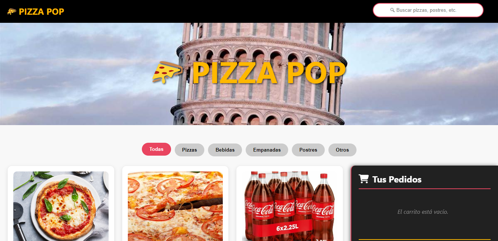
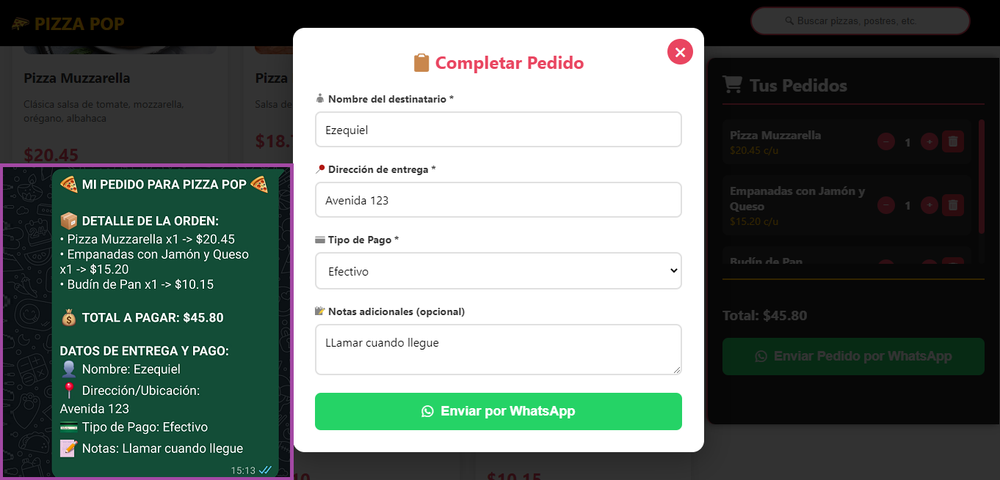
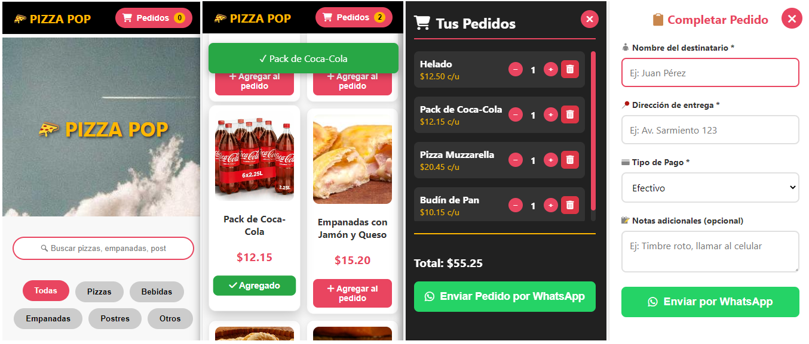

# 🍕 PIZZA POP

Plantilla web interactiva para un restaurante o delivery de pizzas, desarrollada con **HTML, CSS y JavaScript**.  
Incluye un sistema de **carrito**, **búsqueda de productos**, **categorías dinámicas** y **envío directo por WhatsApp**, con soporte para **Firebase Realtime Database**.

---

## 🚀 Características principales

- 📋 **Menú dinámico** con categorías y paginación.  
- 🔍 **Buscador en tiempo real** para filtrar productos.  
- 🏡 **Carrito de compras** con conteo y cálculo automático.  
- 💬 **Envío de pedido por WhatsApp** con mensaje preformateado.  
- ☁️ **Integración con Firebase Realtime Database** para obtener productos desde la nube.  
- 📱 **Diseño responsive** optimizado para móviles y tablets.

---

## 🚀 Tecnologías utilizadas

- **HTML5 / CSS3 / JavaScript (Vanilla)**  
- **Firebase Realtime Database** (para productos y categorías)  
- **Google Fonts**

---

## 📷 Capturas de pantalla

  

  

## No olvides darle ⭐ a este repositorio si te gustó.

